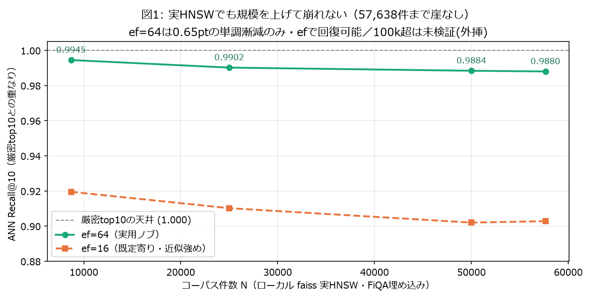
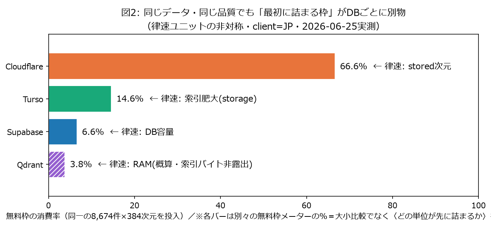

<!-- DRAFT — 公開直前にこのコメントと末尾チェックリストを必ず削除すること。
     数値はすべて results/ の実測値。図はローカルでは 図/ 配下、Qiita投稿時はアップロードURLに差し替える。 -->

# 無料枠だけで4つのベクトルDBに同じRAG検索を流したら、精度は横並び。本当の差は「無料枠が最初に詰まる場所」だった

> Qiita Tech Festa 2026 のお題「**AI時代のデータベース、何が変わる？**」に、**無料枠 × DB横断 × 再現可能な実測**という角度から答えます。
> 対象: **Supabase(pgvector) / Qdrant Cloud / Turso(libSQL) / Cloudflare Vectorize**。データセット BEIR ArguAna(8,674文書)。ローカルCPUのみ・完全無料。
> **測定器の故障や自分の勘違い（Qdrantが実は総当たりだった等）も含め、訂正の過程を全部公開します**（§8）。

> ⚠ **再現性について先に注記**：品質(nDCG/Recall/ANN Recall)と無料枠消費の列は**どこから実行しても同じ表**が出ます。
> ただし**レイテンシ列はクライアントの地理に依存**します（本記事は client=日本）。レイテンシは絶対値でなく**相対傾向**で読んでください。

## TL;DR（結論だけ）

1. **検索品質はDBで変わらない**：4DBとも nDCG@10 = 0.5017〜0.5019 / Recall@10 ≈ 0.79（同一埋め込み・同一統制条件なら、RAGの**検索段(retrieval)**の精度はDB非依存。※本記事の品質はLLM生成でなく検索段の指標）。
2. **ANN忠実度も揃えれば天井近傍**：実際に近似索引を動かした **Supabase(HNSW)・Turso(DiskANN)・Cloudflare(Vectorize) の3エンジン**が ANN Recall@10 = 0.9988〜0.9992 に収束。ローカル実HNSWでも **57,638件まで崖なし**（0.65ptの漸減のみ／100k超は未検証＝外挿）。
3. **本当の差は「無料枠の律速ユニット」がDBごとに別物**：**Supabase=容量 / Qdrant=RAM / Turso=索引肥大 / Cloudflare=stored次元**。同じ8,674件でも「最初に枯れる単位」が違う＝"何ヶ月持つ"を1つの数字で語るのは不正確。
4. **レイテンシ差(e2e)は最大20倍超だが、大半は地理・API経路の交絡**：少なくともSupabase/Qdrantはサーバ側計算<1msで、差の正体は往復RTT（Turso/CFはサーバ側計時N/Aゆえe2e値として読む・後述）。

### サマリ表（全1,406クエリ・既定設定・cosine・topK10・client=JP）

| DB | リージョン | 品質(nDCG/Recall) | ANN Recall@10 | e2e p50 | upsert | 索引サイズ |
|---|---|---|---|---|---|---|
| 厳密kNN(numpy・ANN参照) | local | 0.5017 / 0.7902 | 1.000 | — | — | — |
| **Supabase** pgvector | 東京 | 0.5017 / 0.7909 | 0.9991 | **24.7ms** | 1442/s | 17.7MB(HNSW) |
| **Turso** libSQL | 東京 | 0.5017 / 0.7909 | 0.9992 | 49.7ms | **9.8/s** | **710.8MB(DiskANN=生の53倍)** |
| **Qdrant** Cloud | Oregon | 0.5019 / 0.7916 | 0.9994※ | 142.9ms | 716/s | 非露出 |
| **Cloudflare** Vectorize | global edge | 0.5019 / 0.7909 | 0.9988 | **536ms** | 184/s | 非露出 |

> ※Qdrantの0.9994は**この規模では総当たり(brute-force)由来**で、HNSW近似の忠実度ではない（§6で詳述）。品質列は4DBほぼ同一＝「DBで精度は変わらない」を表で表現。

---

## 1. なぜ「無料枠 × DB横断 × 再現可能な実測」なのか

「AI時代のデータベース、何が変わったか」。本記事の答えは、**埋め込みがストレージを"高次元の索引構造"に変えたことで、無料枠で最初に詰まる単位が『行数/バイト』から『索引そのもの』へ移った**——そしてそれを**無料枠だけでローカルCPUから横断実測できる時代になった**、というものだ（この"律速の移動"を実データで示すのが本記事）。

日本語圏の先行記事を見ると、(a)エンタープライズ大規模の多製品比較、(b)単一DB内の手法比較、(c)機能スペック表が多い。とくに **BEIR×nDCG×Qdrant を扱う良記事があるが、それらは"1つのDBの中で検索手法(Dense/BM25/Hybrid/Rerank)を変える"比較**（先行記事の具体URLは投稿時に併記）。本記事は逆で、**手法を固定し、DBと無料枠を変える**。軸が直交するので住み分く。「無料枠を厳密な制約にして、横断で、再現可能に実測した」記事は空白だった。

売りは**再現性**：`git clone` → 無料の鍵を`.env`へ → `python -m harness.bench`。**品質と消費の表はどこでも同じ**（レイテンシだけは地理依存）。埋め込みはローカルCPUで約3分、GPU不要。

## 2. 実験設定（統制条件）

- **データセット = BEIR ArguAna（corpus 8,674 / queries 1,406 / qrels 1,406）**。
  選定理由：**Cloudflare Vectorizeの無料 stored 上限が「500万次元 ÷ 384次元 ≈ 1.3万ベクトル」と市場で最も小さい**。だからコーパスを小さく保てるArguAnaにした（FiQA 57,638件は**このCF無料stored上限(≈1.3万本)の約4.4倍**で無料枠外。間引くと正解集合qrelsが壊れる）。
- **埋め込み = `all-MiniLM-L6-v2`（384次元・Apache-2.0・CPU）**、`normalize_embeddings=True`（cosine=内積）。`max_seq_len=256`で長文は切られ、**絶対nDCGはこの小型モデル相応に低い**（より強い埋め込みなら上がるが、それはDB比較とは直交）。全DB共通なので横断比較は不変。
- **厳密kNNは"ANN忠実度の参照"**：numpyブルートフォースcosine top10を基準に固定（1,406×8,674がわずか0.1秒）。各DBのANN結果はこの参照に対し採点する。※これは**同一埋め込み・同一cosineでの検索順序の参照**であって、qrels基準のTask品質(nDCG/Recall)の"上界"ではない（DBがtie順序の都合で微小に上回り得る）。
- **自己一致除外が必須**：ArguAnaはクエリ自身がコーパスに入り、**生top1の91%(1,281/1,406)が"自分自身"**。除外しないとnDCGが壊滅的に過大評価される。規則は`doc_id == query_id`（正解は常に別ID＝BEIR標準の`ignore_identical_ids`と論理一致で安全）。
- 参照の nDCG@10 = **0.5017** は、HuggingFaceモデルカードのMTEB ArguAna公開値 **50.17（=0.5017・2026-06-26再確認）と一致**＝パイプラインが標準どおりに動いている外部証拠（Task指標ではDBが+0.0002程度上回る0.5019も出るが、これは"参照破り"でなくtie/順序の揺れ）。

## 3. 4つの無料枠の「事実」（公式ページ・2026-06-26 再確認／ドリフトなし）

| DB | 無料枠 | クレカ | 索引 | 休止ポリシー |
|---|---|---|---|---|
| Supabase(pgvector) | DB 500MB・2プロジェクト | 不要 | HNSW(調整可) | **7日でpause** |
| Qdrant Cloud | RAM 1GB / disk 4GB | 不要 | HNSW(ef調整可) | **1週でsuspend・4週で削除** |
| Turso(libSQL) | storage 5GB / 読5億・書1000万 行/月 | 不要 | DiskANN(ノブ無し) | **常時稼働(休止なし)** |
| Cloudflare Vectorize | stored 500万・queried 3000万 dims/月 | 不要 | managed(black-box) | edge(従来型cold startなし) |

- **東京リージョンの可否が地味に効く**：Supabase/Turso は東京を取れたが、**Qdrant無料は確認日(2026-06-26)時点でアジア不可**（最寄りのOregonを選択。無料リージョンは変わり得るので日付付きで）。Cloudflareはグローバルエッジで単一リージョンの概念がない。→ レイテンシは相対傾向で読む。
- 4DBともクレカ不要で開始できた。

> 出典（2026-06-26確認）: [Supabase Pricing](https://supabase.com/pricing)（Free=500MB・2プロジェクト・1週でpause）／ [Qdrant Pricing](https://qdrant.tech/pricing/)（Free=0.5vCPU/1GB RAM/4GB disk）／ [Turso Pricing](https://turso.tech/pricing)（Free=5GB・読5億/書1000万 行/月・CC不要）／ [Cloudflare Vectorize Pricing](https://developers.cloudflare.com/vectorize/platform/pricing/)（Free=stored 500万/queried 3000万 dims/月）。無料枠は改定され得るため、公開直前に再取得し確認日を更新すること。

## 4. ハーネス設計（要点）

統一インターフェース(`create/upsert/search/stats/teardown`)に各DBを実装。横断で公平にするための要点だけ：**全DB `FETCH_K=30`で取得→自己一致除外→top10に統一**（除外で件数が欠けない）／**scoreは全DB「類似度（大きいほど良い）」に正規化**／**IDはQdrantだけ整数必須**（他は文字列そのまま）／**レイテンシは e2e と サーバ側を分離**、ウォームアップ20破棄・各クエリ3反復でp50/p95。詳細はリポジトリ参照。

## 5. 結果①：品質はDBで変わらない（俗説の反証）

4DBとも **nDCG@10 = 0.5017〜0.5019 / Recall@10 ≈ 0.79**（参照=MTEB公開値0.5017とほぼ一致）。
同じ埋め込みベクトルを入れているのだから当然ともいえるが、**「どのベクトルDBを使うかでRAG検索の精度が変わる」は、本記事の統制条件（同一埋め込み・同一前処理・同一metric・フィルタなし・topK固定・ANN Recall≈1）では成立しない**ことを実データで示せた。差が出るとすれば埋め込みモデルや前処理であって、DBの選択ではない。
> ただし実務では、DBごとの**メタデータ・フィルタ性能／量子化／ハイブリッド検索／更新直後の整合性**で差が出る余地はある。本記事が言えるのは「**素の検索精度**は今回の条件で横並びだった」まで。

## 6. 結果②：ANN忠実度は揃えれば天井近傍（ただし"誰が本当に近似していたか"に注意）

近似索引を実際に動かした **3エンジン(Supabase/Turso/Cloudflare)で ANN Recall@10 = 0.9988〜0.9992 に収束**。揃えればどのDBも天井近傍に届く。

…のだが、ここで**監査中に自分の重大な誤りを見つけた**。
**Qdrantは8,674件では実はHNSW索引を張っておらず、総当たり(brute-force)で検索していた**。鍵は`indexing_threshold`が**「件数」でなく「未索引ベクトルの"サイズ(kB)"」のしきい値**であること（公式：*未索引ベクトルのサイズがこの値(kB)を超えると索引セグメントを構築*）。本コーパスは 8,674本×384次元×4B ≈ **13,000kB** が2セグメントに分かれ**各≈6,500kB**で、私のクラスタの `indexing_threshold=10,000kB`（collection-info で実測）を**下回る**ため `indexed_vectors_count=0`＝総当たりだった（強制構築すると8,674に到達）。つまり**Qdrantの0.9994は厳密検索ゆえ当然で、HNSW近似の忠実度の証拠ではない**（表で別枠の※にした）。
> ★しかも閾値は2つある：索引を強制構築しても、**`full_scan_threshold`（既定10,000kB）**を下回るクエリは plannerが総当たりを選ぶ。**「しきい値は件数でなくkB・しかも2段」**は移植可能な教訓で、**ANN忠実度を測るなら両閾値を超える規模で測る必要がある**——だから本記事の規模検証はローカルfaissに委ねた。（小規模では総当たりの方がHNSW構築より速く・正確なので、Qdrantが索引を作らないのは設計どおりの正しい挙動。）

**「8,674件の偶然では？」を潰すため、ローカルでfaiss実HNSWを規模スイープ**した（FiQAを埋めて8.7k→57.6k）。値は`scale_sweep.csv`そのまま：

| N | ANN Recall@10 (ef=64) | (ef=16) |
|---|---|---|
| 8,674 | 0.9945 | 0.9195 |
| 25,000 | 0.9902 | 0.9102 |
| 50,000 | 0.9884 | 0.9020 |
| 57,638 | 0.9880 | 0.9028 |



**ef=64なら57.6kまで単調に0.65ptだけ漸減し、崖は出ない**（efで回復可能・100k超は外挿で未検証）。「収束は小規模の偶然」ではなく、実HNSWでも規模を上げて崩れないことを確認できた。
> ※このスイープのfaiss値(8,674で0.9945)は、本表のクラウドDB(Supabase 0.9991)と**ef/m設定が違う**ので**絶対水準は直接比較しない**。見たいのは「規模を上げても崖が出ない＝傾向」であって、各DBの忠実度の優劣ではない。

**おまけ：e2e差の正体を実測で剥がす。** サーバ側計算p50は **Supabase 0.45ms / Qdrant 0.81ms（いずれも<1ms）**。同一リージョンで比べられるのは東京の Supabase 24.7ms vs Turso 49.7ms だけ（エンジン差で約2倍）。一方 e2e の 24.7ms↔142.9ms(Qdrant Oregon) の大差は**ほぼ往復RTT**で、エンジンの素の速さの差ではない（Turso/CFはサーバ側計時を取得できずN/A）。

## 7. 結果③（主峰）：無料枠の"持ち"は「律速ユニット」がDBごとに非対称

ここが山場。同じ8,674件を入れても、**無料枠を最初に使い切らせる単位がDBごとに別物**だった。

| DB | 律速ユニット | 使用量 / 無料枠 | 消費率 |
|---|---|---|---|
| Supabase | DB容量＋7日休止 | 約33MB / 500MB | **6.6%** |
| Qdrant | RAM/disk＋1週suspend | node RSS Δ≈38MB（索引バイトは非露出） | **~3.8%(概算)** |
| Turso | **索引肥大**(storage)＋逐次投入 | 729MB / 5GB（うち索引710.8MB＝生の53倍） | **14.6%** |
| Cloudflare | **stored次元** | 3,330,816 / 5,000,000 | **66.6%** |



- **Supabase=容量**：約33MBで余裕。むしろ7日休止が先に効く。
- **Qdrant=RAM**：律速はRAM 1GB。面白いことに**コレクションの索引バイト数はAPIに出ない**（生ベクトル分13.3MBは出るが、HNSWを強制構築してもtelemetryの`ram/disk_usage_bytes`は0＝露出されないだけで、ゼロコストではない）。実RAMは投入前後の**node RSS差で約38MB増を観測**＝1GBの約3.8%（上界推定）。Supabaseの17.7MBやTursoの710.8MBと直接比較できないのが、逆に"測れない律速"の好例。
- **Turso=索引肥大**：屈指の隠れコスト。**生ベクトル13.3MBが、DiskANN索引で710.8MB（53倍）に膨張**。さらに**投入が9.8件/秒＝Supabase(1442件/秒)の約147倍遅い**（DBの絶対性能差でなく**"逐次索引 vs 一括後構築"という今回の投入パターン差**）。この**「投入147倍遅い」と「索引53倍肥大」は同根**——TursoはDiskANNグラフを挿入のたびに逐次更新するため、投入(約880秒)のほぼ全部がその書き直しに消える。Supabaseは違って**COPY一括(2.8秒)→HNSWを後からまとめて構築(3.2秒)**で済む。一方**行課金は読み0.6%(3,131,435/5億)・書き5%(496,276/1000万)とどちらも余裕**＝Tursoを律速するのは行数でなくstorageだけ。**同じDBでもメーターは複数あり、最初に枯れるのは1つ**——という本記事の核心を体現する。VACUUMはTurso Cloudで不可だが、DROP/作り直しで課金ストレージは回収（DROP後8KB）。
- **Cloudflare=stored次元**：8,674件で**stored枠の66.6%＝4DB中最も窮屈**。queriedはCF公式の課金式で**月内の queried dims =（その月の総クエリ数＋stored数）×次元**（公式例も`(30,000+10,000)×768`＝**storedは月1回だけ加算**）。よって**初回フル評価は (1,406+8,674)×384 ≈ 387万dims**だが、2回目以降はstored分が乗らず**54万dims/評価**だけ。月枠30Mでは **(30,000,000−333万)÷54万 ≈ 49評価/月（≈1.6回/日）**。※387万を30Mで単純に割ると7.75回に見えるが、それはstoredを毎回二重計上した誤り（公式式はstored月1回）。stored律速の痛みがいちばん早く来る。

**結論：無料枠の"持ち"を単一スカラーで語ることはできない。** 「最初に枯れる単位」がSupabase=容量、Qdrant=RAM、Turso=索引肥大、Cloudflare=stored次元と違うからだ。**埋め込みがストレージを高次元索引に変えたAI時代だからこそ、選定軸は「速い/賢い」でなく"自分のワークロードで最初に枯れる律速ユニットはどれか"に変わった**——価格表でなく律速で選ぶ。

## 8. 落とし穴ログ（測ってから語る・自分の誤りも含めて）

この企画でいちばん学びがあったのは、**測ってみて初めて分かった/自分が間違っていた**ことたち。「誤→正」で並べる。

- **Qdrantは8.7kで総当たりだった**（§6）。誤=「天井到達はHNSW忠実度の証拠」→ 正=「indexed_vectors_count=0、近似してるつもりで総当たり」。一次実測で覆して訂正。
- **Tursoの肥大を測る計器自体が壊れていた**。誤=`pragma_page_count`の約695MB → 正=それはTurso Cloudで行数に無関係な定数。dbstatで測り直して53倍を確定。
- **Cloudflare Vectorizeの非同期/結果整合**。誤=「upsert直後にqueryできる」→ 正=**upsertは非同期で反映待ち(バリア)が要る**。さらに**vectorCountが結果整合で非単調にぶれる**(8,674↔5,000)。これはエッジ分散×結果整合の設計上の帰結で、書込み直後のread-your-writesが保証されない＝**vectorCountは課金照合のソースにできない**。逆に従来型cold startが無いのはこの設計の裏返しの利点。
- **Vectorizeの index は delete→即再作成がレース**：削除済みの名前がしばらく`410 index deleted`を返し初回upsertが落ちた→「再利用or作成（deleteしない）」で回避。
- **管理画面が母国語自動翻訳で死ぬ**：TursoダッシュボードがブラウザのEN→JA翻訳とReactのDOM操作衝突で`removeChild`クラッシュ→**GUIを諦めREST APIで構築**したら一発。「無料DBはGUIよりAPIで作れ」。
- **単位の混在**：容量%をバイナリ(1024)と10進(1000)で混在計算し、同じ値が6.3%と6.6%に割れていた→10進SIに統一。

これらは全部、**新規の上位モデル監査エージェント＋一次裏取り**で公開前に潰した。「鵜呑みにしない」を自分の成果にも適用したのが効いた。

## 9. cold start / 休止ポリシー

「速さ」の裏で効くのが休止だ。**Tursoだけが常時稼働（休止なし）**で、これは地味だが大きい。Supabaseは7日、Qdrantは1週でアイドル休止し初回アクセスで復帰待ちが発生しうる（Qdrantは4週で削除）。Cloudflareはエッジで従来型cold startが無い。
※**真の"休止からの復帰レイテンシ"は、休止条件(数日アイドル)の再現に時間がかかるため本記事では未測定**。ここでは「常時稼働か/休止ありか」のポリシー比較に留める（測っていないものを測ったとは書かない）。

## 10. 再現手順

```bash
git clone <repo> && cd qiita-vectordb-bench
python -m venv .venv && ./.venv/Scripts/python.exe -m pip install -r requirements.txt
# 無料の鍵を .env に（Supabase接続文字列 / Qdrant URL+APIキー / Turso URL+token / CF account+token）
python -m harness.download_data && python -m harness.embed   # ArguAna取得＋CPU埋め込み(約3分)
python -m harness.exact_knn                                   # 厳密kNN（ANN忠実度の参照）
python -m harness.bench --db all                              # 3DB実測 → results/summary.csv
python -m harness.bench --db cf --no-teardown                 # Cloudflare(4本目)
python -m scripts.consumption_report                          # §7 消費メーター表
```

CPUのみ・GPU不要。Cloudflareは`wrangler login`(ワンクリックOAuth)→`wrangler vectorize create`で無料作成できる。

**検証環境（再現性のため）**：Python 3.12 / sentence-transformers 5.6.0 / numpy 2.5.0 / qdrant-client 1.18.0 / psycopg 3.x / libsql-client 0.3.1 / faiss-cpu 1.14.3（規模スイープ用）。全ピンは `requirements.lock.txt`。データセット＝BEIR ArguAna（TU Darmstadt公式zip）、モデル＝`sentence-transformers/all-MiniLM-L6-v2`。

## まとめ：AI時代のDB選定で「何が変わったか」

無料枠だけで、ローカルCPU3分の埋め込みから、4つのベクトルDBに同一RAGを流して横断実測できた。分かったのは：

1. **品質はDBで変わらない**（同一埋め込みなら）。
2. **ANN忠実度も揃えれば天井近傍**（実HNSWで57.6kまで崖なし・100k超は外挿）。
3. **本当の差は"無料枠の律速ユニット"の非対称**（容量/RAM/索引肥大/stored次元）。

埋め込みがストレージを高次元索引に変えたことで、無料枠の限界は「行/バイト」から「索引そのもの（Turso 53倍肥大・CF stored枠）」へ移った。だから選定の軸は「どれが速い/賢い」でなく、**「自分のワークロードで最初に枯れる単位はどれか」**——価格表でなく律速で選ぶ、それが無料枠時代のDB選定だと思う。

---

*計測コード・全CSV・落とし穴ログはリポジトリに同梱（再現可能）。数値はすべて実測値で、検証できなかったもの（休止復帰レイテンシ・100k超の規模）は「測っていない」と明記した。*

<!-- 公開前チェック（実施後に本コメントごと削除）— 残りはブラウザ操作のみ:
     ①Qiitaで「登録する」＋指定タグ（推奨: ベクトルDB, RAG, pgvector, Qdrant, Cloudflare, Supabase）
     ②無料枠の数値=2026-06-26 再確認済（4DBともドリフトなし）✓
     ③MTEB ArguAna nDCG@10=50.17 再確認済 ✓ → リーダーボードのスクショ添付のみ残
     ④図1/図2をQiitaにアップロードしURLに差し替え（本文の 図/ 相対パスを置換） -->
